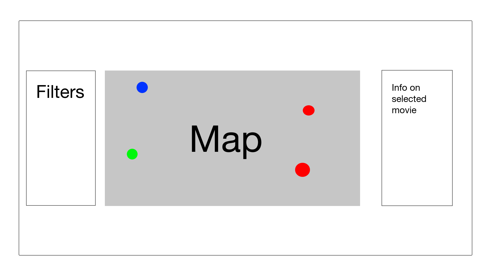

## SF Film Locations - An analysis of the most popular film locations in SF

### Background and Overview

SF Film Locations is a data visualization tool that lets you see the most popular places in SF where movies were filmed.

Locations with multiple movies filmed there will be a different color, users will be able to click the location and a menu will popout showing all the movies filmed there.

### Functionality & MVP  

In SF Film Locations, users will be able to:

- [ ] View all films on the map at once
- [ ] Filter by movie
- [ ] Filter by year
- [ ] Filter by activity
- [ ] Click a link to the movie's IMDb page

In addition, this project will include:

- [ ] An About modal describing what the information being displayed is

### Wireframes

This app will have a large map display with dots over each of the locations, with filters on one side, and info on the selected movie on the right.

### Architecture and Technologies

This project will be implemented with the following technologies:

- Vanilla JavaScript for overall structure and logic,
- `HTML5 Canvas` for DOM manipulation and rendering,
- `d3.js` to display and map out all the date,
- `Google Maps API` to accurately display the film locations in relation to an actual map
- Webpack to bundle and serve up the various scripts.

### Implementation Timeline

**Over the weekend**:

- [x] Research d3.js

### Bonus features
